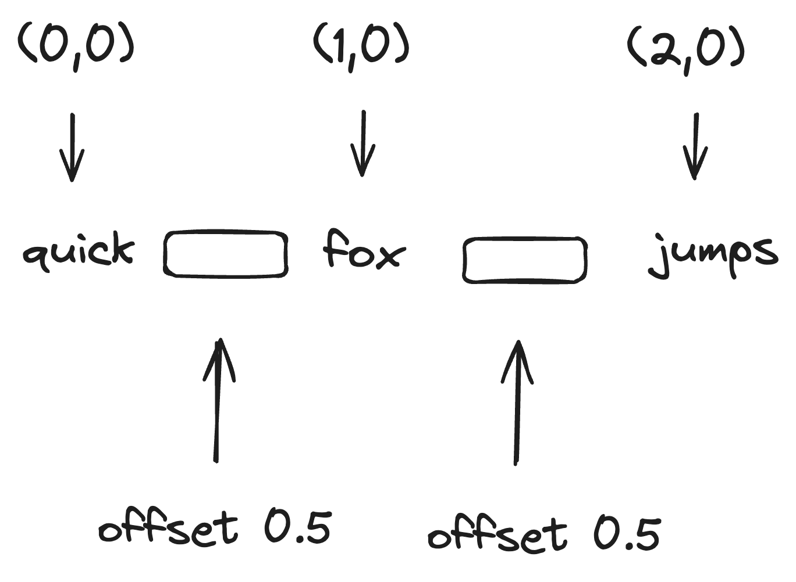
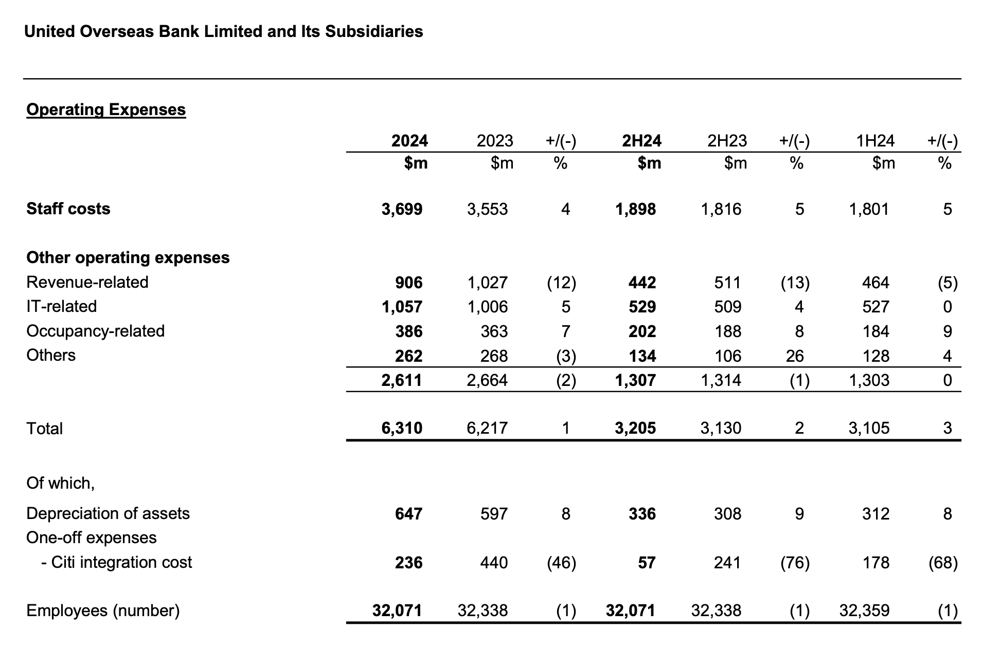

# The Hidden Challenges of PDFs in GenAI (And How to Solve Them)

PDFs are a necessary evil in the digital world—a billion-dollar mistake that we are forced to work with.

From students to legal documents, startups to enterprise, PDF is the most widely used format when it comes to sharing
unstructured information. Despite its usefulness and widespread adoption, the cost of integrating PDFs with model tools - especially GenAI, is
continuously rising.

I’ve tested libraries, third party services, and even implemented custom solutions myself.
None of them have yielded a truly satisfactory result.

Today I am going to share the trade-offs between all these libraries.
What works, what doesn’t, and how to pick a good enough solution for your use case.

## Understanding PDF Representation

Let's explore the inherent issues of PDFs.
PDF internal representation prioritizes portability across digital platforms - Android, iOS, Window, Mac, Linux, etc.,

It's designed to solely rely on cartesian ( x / y ) coordinates system, whether it is

- rendering text
- spaces
- line breaks
- even visual elements ( e.g., tables borders )

### Text & Spaces

Say we want to render this piece of text - "quick fox jumps dog",
we can represent as following.

```json
{
  "text": "quick fox jumps dog",
  "x": 0,
  "y": 0
}
```


At first, the use of ( x / y ) seems perfectly fine. Let's see another example.

```ts
// Just assume each word has the same length for this example
[{"text": "quick", "x": 0, "y": 0, "width": 0.5, "height": 0.3}
	, {"text": "fox", "x": 1, "y": 0, "width": 0.5, "height": 0.3}
	, {"text": "jumps", "x": 2, "y": 0, "width": 0.5, "height": 0.3}
	, {"text": "dog", "x": 3, "y": 0, "width": 0.5, "height": 0.3}
]
```

There is no restriction on representing the same text in different structures.
This will result in the same visual representation at the end user perspective.

If you look closely, there is no **space** in any of these the block.

So, how would you get the same result?? <br />
➡️ **x / y coordinates offset**

Take a look at the following image.



PDF builder can represent in the same way for other important building blocks like new lines, column layouts, tables
etc.,
When a PDF reader processes these blocks and reconstructs them, the resulting text can lack spaces.

### Natural Reading Order

In English, we read from top to bottom, left to right.
In Arabic, Urdu, and Middle East languages, we read from left to right, top to bottom.
In Chinese, Japanese, and Korean languages also have vertical writing system where we have to read from top to bottom
first, then left to right.

PDF internal representation doesn't enforce the natural reading order.
We can write down the text and ( x / y ) coordinates pairs in any order regardless of their position in the page.

```ts
[{"x": 0, "y": 1, "text": "header"}
	, {"x": 1, "y": 2, "text": "Page 1 / 2"}
	, {"x": 0, "y": 2, "text": "paragraph 1"}
	, {"x": 0, "y": 3, "text": "paragraph 2"}
	, {"x": 0, "y": 4, "text": "footer"}
]
```

Above example is the ideal representation. It shows that the representation follows our reading order.
However, someone could reorder these text blocks in any order, while still maintaining the same visual output.

```ts
// Both representation in PDF internal & what we will get after reading with PDF readers.
[{"x": 0, "y": 4, "text": "footer"}
	, {"x": 1, "y": 2, "text": "Page 1 / 2"}
	, {"x": 0, "y": 2, "text": "paragraph 1"}
	, {"x": 0, "y": 3, "text": "paragraph 2"}
	, {"x": 0, "y": 1, "text": "header"}
]
```

Here, I am talking about top to bottom structure.
This also applies to left-to-right text elements.

A simple way to fix this problem is to sort the text blocks (in case of English)

- top to bottom, sort by y coordinates
- then left to right, sort by x coordinates

Most PDF reader libraries don't have this.

However, simple sorting will not work if your document contains

- other elements like tables embedded in the middle of text
- multi column layouts

We have two options here to detect the layout.

1. use the algorithmic approach (will not cover all the cases)
2. use deep learning models to detect the layout

### Tables

Tables are used to conveying important information.
For example,

1. Financial statements, invoices, sales figures, transaction records
2. Statistical results, metrics
3. Comparison across different entities
4. Compliance checklists and more...

Let's try to understand why it is so hard to extract the tables from PDF.

There are two types of tables.
1. tables with borders ( borders whole table, rows, columns )
2. borderless table

Below is an example of borderless tables taken from UOB Bank's financial statement.



#### Tables with Borders

From end user's perspective, we see the table borders as `rectangles`.

PDF internally has something called operators to represent the visual element.
Below are some popular operators.

1. moveTo (move the drawing from point A to point B, this is intended for building complex polygons)
2. lineTo (draw a line from point A to point B)
3. curveTo (draw a curve on cartesian)
4. rectangle (draw a rectangle, need to specify x, y, width and height)

Table borders, rows, and columns boundaries are best represented using rectangles.
When reading PDF content using libraries, identifying tables should be as simple as:
- extracting all the rectangles
- grouping those based on the layout (e.g., cell rectangle belongs to the parent table border rectangle)

However, one could just use `lineTo` or `moveTo` and draw four lines to form a rectangle.
This makes it very hard to identify the tables.

Fortunately, there are libraries out there which do hard work for you - covering all these `lineTo` / `moveTo` to detect
the table layouts.
Let's look at the borderless tables.

#### Borderless Tables

If you read up to this point, you probably have a sense of what the PDF representation is trying to do.

Refer to UOB Bank's financial statement table image.
To appear as table without any bounded border, we just have to align the cell items in the same column and row using the
appropriate x / y values.

We could try to solve this algorithmically by analyzing positions of the text items.
However, the ground is just too wide to cover.

Here are the examples:

**Column Width**

Text inside the cells could be left align, right align, or centered.
These could also contain line breaks.

**Row Height**

Even in our example,
text "Other operating expenses" - serves as section title row while
text "One-off expenses" followed by "- Citi integration cost" should ideally be merged into one single row.
text "Of which," - can stays as dedicated row

The point is whether we should merge the text into one row (hence higher height) or we should separate into multiple
rows also depends on
the meaning of the text itself.

To tackle the borderless tables, a good approach is to use deep learning models.
Here are a few good candidates:

1. **YOLOX v8** - has a magnificent performance in identifying the borderless tables.
2. **Detectron2** - open source model from facebook designed for object detection, and segmentation.

But these can only give us the bounding box of the whole table.

Table Transformers - a family of deep learning models used to identify the table structure, rows and columns.
You can read more here - https://huggingface.co/docs/transformers/model_doc/detr.

The following two models are a good start:

1. Table Detection -  https://huggingface.co/microsoft/table-transformer-detection
2. Table Structure Detection - https://huggingface.co/microsoft/table-transformer-structure-recognition

These model can provide the x , y coordinates, width and height of rows and columns.
We should also apply post-processing by using algorithmic approach to further tune the results based on our use case.

## Final Thoughts

Extracting structured data from PDFs remains a complex challenge due to their visual nature and lack of strict content
hierarchy.
While simple text sorting can help in basic cases, multi-column layouts and borderless tables require more sophisticated
approaches.

A hybrid method - combining algorithmic sorting with deep learning models like YOLOX and Table Transformers offers the
best balance between
accuracy and performance. As GenAI applications evolve, investing in robust PDF parsing strategies will be essential to
unlocking valuable insights from unstructured documents.