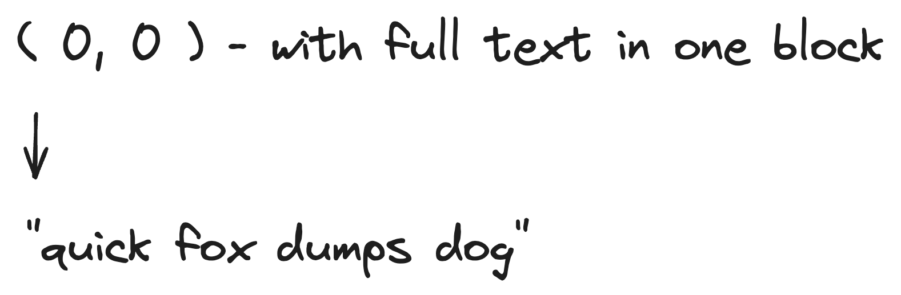

# Comprehensive Guide to Choosing a PDF Reader for your next GenAI Application


PDF - it is a billion-dollar mistake that I would name even in my dream.

From students to legal documents, startups to enterprise, PDF is the most widely used format when it comes to sharing unstructured information.
As much as it is useful and widely adopted, the cost that we are paying for it to integrate with other tools & technologies - like GenAI is just spiking up.

I’ve tested libraries, third party services, and even implemented custom solutions on my own. <br />
None of these gives me a satisfactory result.

Today I am going to share the trade-offs between all these libraries. <br />
What works, what doesn’t, and how to pick a good enough solution for your use case.

## Understanding PDF Representation

Let's dive into what are the inherent issues with the PDF. <br />
PDF internal representation favors the portability across digital platforms - android, iOS, Window, Mac, Linux, etc.,

It's designed to solely rely on cartesian ( x / y ) coordinates system, whether it is
- rendering text
- spaces
- line breaks
- even visual elements ( e.g., tables borders )


### Text & Spaces

Say we want to render this piece of text - "quick fox jumps dog", <br />
we can represent as following.
```json
{ "text": "quick fox jumps dog", "x": 0, "y": 0 }
```



At first, the use of ( x / y ) seems perfectly fine.  Let's see another example.
```ts
// Just assume each word has the same length for this example
[{ "text": "quick", "x": 0, "y": 0, "width": 0.5, "height": 0.3 }
,{ "text": "fox",   "x": 1, "y": 0, "width": 0.5, "height": 0.3 }
,{ "text": "jumps", "x": 2, "y": 0, "width": 0.5, "height": 0.3 }
,{ "text": "dog",   "x": 3, "y": 0, "width": 0.5, "height": 0.3 }
]
```

Nothing is preventing someone to represent the same text with this new structure. <br />
This will result in the same visual representation at the end user perspective.

If you look closely, there is no **space** in any of these the block.

So, how would you  get the same result?? <br />
➡️ **x / y coordinates offset**

Take a look at the following image.


People can just do the same for other important building blocks like new lines, column layouts, tables etc.,

### Natural Reading Order

In English, we read from top to bottom, left to right. <br/>
In arabic, urdu, and middle east languages, we read from left to right, top to bottom. <br />
In Chinese, Japanese, and Korean languages also have vertical writing system where we have to read from top to bottom first, then left to right. <br />

PDF internal representation doesn't enforce the natural reading order. <br />
We can write down the text and ( x / y ) coordinates pairs in any order regardless of their position in the page. <br />

```ts
[{ "x": 0, "y": 1, "text": "header" } // item 1
,{ "x": 1, "y": 2, "text": "Page 1 / 2" } // item 2
,{ "x": 0, "y": 2, "text": "paragraph 1" } // item 3
,{ "x": 0, "y": 3, "text": "paragraph 2" } // item 4
,{ "x": 0, "y": 4, "text": "footer" } // item 5
]
```

Above example is the ideal representation. It shows that the representation follows our reading order.
However, one could also just footer block in place of `Item 1` and get the same result.

```ts
// Both representation in PDF internal & what we will get after reading with PDF readers.
[{ "x": 0, "y": 4, "text": "footer" } // item 1
,{ "x": 1, "y": 2, "text": "Page 1 / 2" } // item 2
,{ "x": 0, "y": 2, "text": "paragraph 1" } // item 3
,{ "x": 0, "y": 3, "text": "paragraph 2" } // item 4
,{ "x": 0, "y": 1, "text": "header" } // item 5
]
```

Here, I am talking about top to bottom structure.
This also applies left to right text elements.

A simple way to fix this problem is to sort the text blocks (in case of English)
- top to bottom, sort by y coordinates
- then left to right, sort by x coordinates

Most PDF reader libraries don't have this.

However, simple sorting will not work if your document contains 
- other elements like tables embedded in the middle of text
- multi column layouts
<br />
<br />

We have two options here to detect the layout.
1. use the algorithmic approach (will not cover all the cases)
2. use deep learning models to detect the layout

### Tables

Tables are used to communicate the important information

For example,
- Financial statements, invoices, sales figures, transaction records
- Statistic results, metrics
- Comparison across different entities
- Compliance checklists and more...

Let's try to understand why it is so hard to extract the tables from PDF.

There are two types of tables.
1. tables with borders ( borders whole table, rows, columns )
2. borderless table

Below is an example of borderless table taken from UOB Bank's financial statement.


### Tables with Borders

From end user's perspective, we see the table borders as `rectangles`.

PDF internally has something called operators to represent the visual element.
Below are some popular operators.
1. moveTo (move the drawing from point A to point B, this is intended for building complex polygons)
2. lineTo (draw a line from point A to point B)
3. curveTo (draw a curve on cartesian)
4. rectangle (draw a rectangle, need to specify x, y, width and height)

For table border, row and column boundaries, rectangle are the most suitable ones to represent with.
When reading the PDF content's using the libraries, to identify the tables, it should be just easy as
- extracting all the rectangles
- grouping those based on the layout (e.g., cell rectangle belongs to the parent table border rectangle)

However, one could just `lineTo` and draw four lines to form a rectangle. <br />
Or use `moveTo` to draw a rectangle.
This makes it very hard to identify the tables.

Fortunately, there are libraries out there which do hard work for you - covering all these `lineTo` / `moveTo` to detect the table layouts.
Let's look at the borderless tables.

### Borderless Tables

If you read up to this point, you probably have a sense of what the PDF representation is trying to do.

Refer to UOB Bank's financial statement table image.
To appear as table without any bounded border, we just have to align the cell items in the same column and row using the appropriate x / y values.

We could try to solve this algorithmically by analyzing positions of the text items. <br />
However the ground is just too wide to cover. <br />
Here are the examples.

**Column Width** 

Text inside the cells could be left align, right align, or centered. 
These could also contains line breaks.

**Row Height**

Even in our example,
text "Other operating expenses" - serves as section title row while
text "One-off expenses" followed by "- Citi integration cost" should ideally be merged into one single row.
text "Of which," - can stays as dedicated row

The point is whether we should merge the text into one row (hence higher height) or we should separate into multiple rows also depends on
the meaning of the text itself.

To tackle the borderless tables, a good approach is to use deep learning models.
Here are a few good candidates:
1. **YOLOX v8** - has a magnificent performance in identifying the borderless tables.
2. **Detectron2** - open source model from facebook designed for object detection, and segmentation.

But these can only give us the bounding box of the whole table.

Table Transformers - family of deep learning models used to identify the table structure, rows and columns.
You can read more here - https://huggingface.co/docs/transformers/model_doc/detr.

The following two models are a good start:
1. Table Detection -  https://huggingface.co/microsoft/table-transformer-detection
2. Table Structure Detection - https://huggingface.co/microsoft/table-transformer-structure-recognition

These model can give us the x , y coordinates, width and height of rows and columns.
We should also post-processing by using algorithmic approach to further tune the results based on our use case.